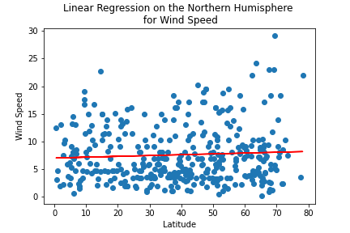
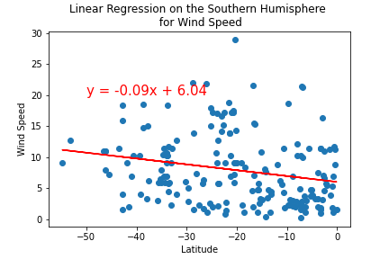

# World Weather Analysis

## Project Overview 
## TJack loves the PlanMyTrip app. Beta testers love it too. And, as with any new product, they’ve recommended a few changes to take the app to the next level. Specifically, they recommend adding the weather description to the weather data you’ve already retrieved in this module. Then, you'll have the beta testers use input statements to filter the data for their weather preferences, which will be used to identify potential travel destinations and nearby hotels. From the list of potential travel destinations, the beta tester will choose four cities to create a travel itinerary. Finally, using the Google Maps Directions API, you will create a travel route between the four cities as well as a marker layer map.

## Resources 
### Software: Python 3.6.9, Anaconda Navigator 1.9.7, Jupyter Notebook 6.0.1
### APIs: Google Maps, Open Weather

## Challenege Overview

### Generate a set of 2,000 random latitudes and longitudes, retrieve the nearest city, and perform an API call with the OpenWeatherMap. In addition to the city weather data you gathered in this module, use your API skills to retrieve the current weather description for each city. Then, create a new DataFrame containing the updated weather data. Use input statements to retrieve customer weather preferences, then use those preferences to identify potential travel destinations and nearby hotels. Then, show those destinations on a marker layer map with pop-up markers. . Use the Google Directions API to create a travel itinerary that shows the route between four cities chosen from the customer’s possible travel destinations. Then, create a marker layer map with a pop-up marker for each city on the itinerary
## Challenege Summary

### We created a Dataframe that contains city, country, latitudes, longitudes, max tempuature, humidity, cloudyness, windspeed, along with a current discription of the weather 

### After choosing a cordanates we find the location and hotels in or next to our choosen cordanates

### We made a Vaction plan that starts from Virginia, travels too Misssouri and Rhode Island, then finally ends in South Dakota. Also, we pointed out hotel on the ruite of each of these states. 
